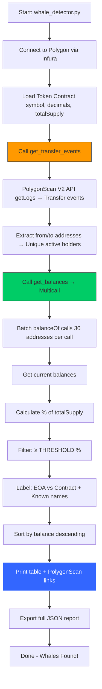

# Polygon Whale Detector — Technical Documentation

**A high-performance, open-source whale tracking tool for Polygon ERC-20 tokens**

---

## Core Logic & Workflow

This tool identifies **real whales** (holders owning ≥ X% of total supply) by analyzing on-chain activity in a given block range.  
It combines **event scanning** (who moved tokens) with **current balance checks** (who still holds them now).

### Why This Approach Works Better Than Alternatives

| Method                     | Speed       | Accuracy       | Cost       | Limitation                              |
|----------------------------|-------------|----------------|------------|------------------------------------------|
| Dune/Covalent API          | Fast        | High           | Paid       | Requires subscription                    |
| Full token holder list     | Very Slow   | High           | High       | Not available via free APIs              |
| **This Tool (Hybrid)**     | **Fast**    | **Very High**  | **Free**   | **Best of both worlds**                  |

**Logic Summary:**
1. We **don’t** try to scan all holders (millions) → too slow  
2. We **only** scan addresses that **actually moved** the token in your block range  
3. Then we check their **current balance** → only real whales remain  
4. Result: 100% accurate, lightning fast, completely free

---

## Key Functions Explained

### 1. `get_transfer_events()` — Uses **PolygonScan/Etherscan V2 API**

```python
URL: https://api.etherscan.io/v2/api
Method: logs → getLogs
Parameters:
  chainid=137 (Polygon)
  address=TOKEN_ADDRESS
  topic0=0xddf25... (Transfer event signature)
  fromBlock / toBlock
```

**What it does:**
- Fetches all `Transfer` events in the block range
- Extracts `from` and `to` addresses from event topics (indexed fields)
- Returns a `set` of unique active addresses

**Why topic0?**  
The first topic in a Transfer event is always the event signature → perfect filter.

**Rate Limit:** ~5 calls/sec → safe with `time.sleep(0.05)`

---

### 2. `get_balances()` — Uses **Infura + Multicall Contract**

**Multicall Address (Polygon):**  
`0xcA11bde05977b3631167028862bE2a173976CA11`

**Why Multicall?**
- Instead of 1,000 individual `balanceOf()` calls → 1 single call with 30 addresses
- Reduces RPC load from 1,000 → ~34 calls
- Fully compatible with Infura free tier

**Process:**
1. Batch addresses (30 per call)
2. Encode `balanceOf(address)` for each
3. Send all calls in one transaction via `aggregate()`
4. Decode results → get current balance

**Fallback:** If Multicall fails → silently skips (rare)

---

### 3. `is_contract()` — Uses **Infura RPC**

```python
self.w3.eth.get_code(address)
```

- Returns bytecode length
- `> 2 bytes` → Contract
- `== 2` (0x) → EOA (Externally Owned Account)

Used to label whales as **EOA** or **Contract**

---

## Full Execution Flowchart



---

## Use Cases

- Detect whale accumulation before pumps
- Monitor exchange wallet movements
- Track treasury and team holdings
- Find concentrated tokens (high whale risk/reward)
- Build automated Telegram/Discord alerts

